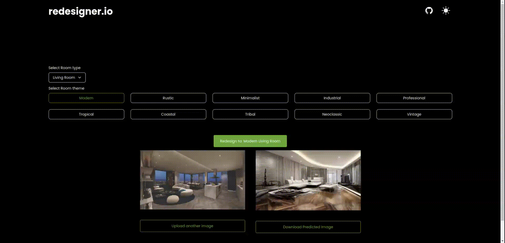

<div align="center">
  
  <h1><a href="https://www.redesigner.io/">redesigner.io</a></h1>

Redesign your house interior and exterior with AI.
Free of charge!</span>

Feel free to reach us on our social platforms! 😊 <br />
<a href="https://www.youtube.com/@bgwebagency">YouTube</a> || <a href="https://discord.com/invite/62VR3MMCVm">Discord</a> || <a href="https://www.instagram.com/bgwebagency">Instagram</a> || <a href="https://www.twitter.com/kirankdash">Twitter</a> || <a href="https://www.tiktok.com/@bgwebagency">TikTok</a> || <a href="https://www.bgwebagency.in">Blog</a> || <a href="https://www.facebook.com/bgwebagency">Facebook</a>

🙏 Support

Please ⭐️ star this project and share it with others to show your support. [Follow me](https://github.com/kirandash) ❤️ for updates on future projects and tutorials!

---

</div>

## Tutorial

- Watch full tutorial on how I built this on my [YouTube channel](https://youtu.be/4YXUGuo9OM4) for free!


## Demo



## Getting Started

1. **Fork the project**: Click the "Fork" button at the top-right corner of the project's GitHub page to create a copy of the repository under your own GitHub account.

2. **Clone the forked repository**: Open your terminal and navigate to the desired directory. Use the following command to clone the repository to your local machine:

   ```bash
   git clone https://github.com/yourGitHubUsername/redesigner.io
   ```

   - Replace the yourGitHubUsername with your username

3. **Install Dependencies**:

   ```bash
   npm install
   ```

4. **Run the project**:

   ```bash
   npm run dev
   ```

   - Check in the localhost if it's working
     \
     <br>

5. **Create a new branch using the command**:

   ```bash
   git branch newBanchName
   ```

   - Try to use a specific name for example: issue36-button-color-change
     \
     <br>

6. **Change to the new branch**:

   ```bash
   git checkout newBranchName
   ```

7. **Make the modifications**.

   Make the code modifications and test it.

8. **Make a commit**

   ```bash
   git add .
   ```

   ```bash
   git commit -m "your comment"
   ```

   - Please make a meaningful comment like: "I change the color of the button submit"
     \
     <br>

   ```bash
   git push origin newBranchName
   ```
